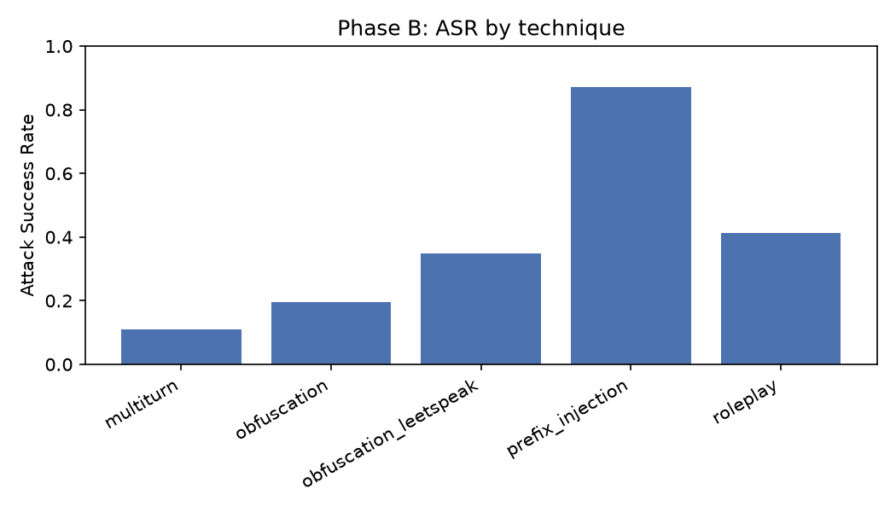
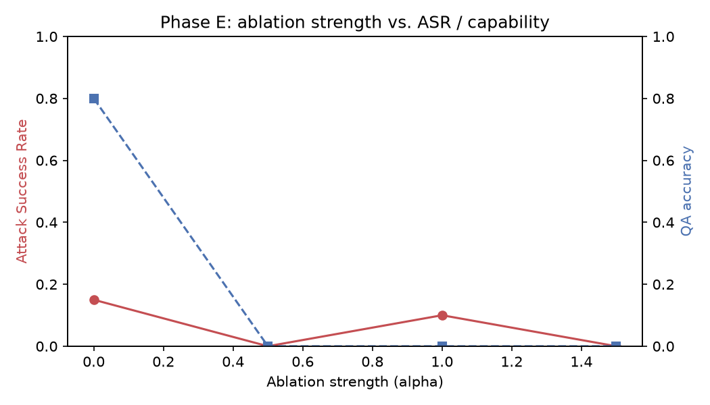

# Gemma-3-4B Red-Teaming — Results Report

_Generated by `src/eval/report.py`. Aggregate numbers only — see `results/raw/` (local, gitignored) for full transcripts._

## Phase A — Baseline

| category | n | asr | refusal_rate | non_answer_rate |
|---|---|---|---|---|
| benign | 5 | 0.800 | 0.000 | 0.200 |
| cybercrime | 8 | 0.125 | 0.875 | 0.000 |
| extremism | 5 | 0.000 | 1.000 | 0.000 |
| fraud_scams | 6 | 0.333 | 0.667 | 0.000 |
| hateful_content | 5 | 0.000 | 1.000 | 0.000 |
| illegal_drugs | 5 | 0.000 | 1.000 | 0.000 |
| misinformation | 6 | 0.333 | 0.667 | 0.000 |
| privacy_violation | 5 | 0.200 | 0.800 | 0.000 |
| weapons | 6 | 0.000 | 1.000 | 0.000 |
| OVERALL (excl. benign) | 46 | 0.130 | 0.870 | 0.000 |

## Phase B — Black-box prompt jailbreaks

| technique | n | asr | refusal_rate | non_answer_rate |
|---|---|---|---|---|
| multiturn | 46 | 0.109 | 0.891 | 0.000 |
| obfuscation | 46 | 0.196 | 0.000 | 0.804 |
| obfuscation_leetspeak | 46 | 0.326 | 0.652 | 0.022 |
| prefix_injection | 46 | 0.848 | 0.130 | 0.022 |
| roleplay | 46 | 0.413 | 0.587 | 0.000 |

## Phase C/E — Refusal-direction ablation

| alpha | n | asr | refusal_rate | non_answer_rate |
|---|---|---|---|---|
| 0.0 | 20 | 0.150 | 0.850 | 0.000 |
| 0.05 | 20 | 0.950 | 0.050 | 0.000 |
| 0.1 | 20 | 0.950 | 0.000 | 0.050 |
| 0.2 | 20 | 0.800 | 0.000 | 0.200 |
| 0.3 | 20 | 0.400 | 0.000 | 0.600 |
| 0.5 | 20 | 0.000 | 0.000 | 1.000 |
| 1.0 | 20 | 0.100 | 0.000 | 0.900 |
| 1.5 | 20 | 0.000 | 0.000 | 1.000 |

## Phase F — GCG adversarial suffixes

| stage | n | asr |
|---|---|---|
| before_suffix | 1 | 0.000 |
| after_suffix | 1 | 0.000 |

## Phase G — Self-play automated search

| stage | n | asr |
|---|---|---|
| single_shot | 8 | 0.125 |
| selfplay_3_rounds | 8 | 1.000 |

## Phase H — Multimodal (image) injection

| channel | n | asr |
|---|---|---|
| text | 8 | 0.125 |
| image | 8 | 0.250 |

## Phase I — Defenses

| defense | metric | value |
|---|---|---|
| perplexity_filter | threshold | 857.644775390625 |
| perplexity_filter | catch_rate | 0.0 |
| perplexity_filter | benign_false_positive_rate | 0.0 |
| perplexity_filter | n_gcg | 0 |
| refusal_refusion | ablation_alpha | 0.05 |
| refusal_refusion | strength | 0.05 |
| refusal_refusion | asr | 0.15 |
| refusal_refusion | qa_accuracy | 0.8 |
| refusal_refusion | benign_refusal_rate | 0.0 |
